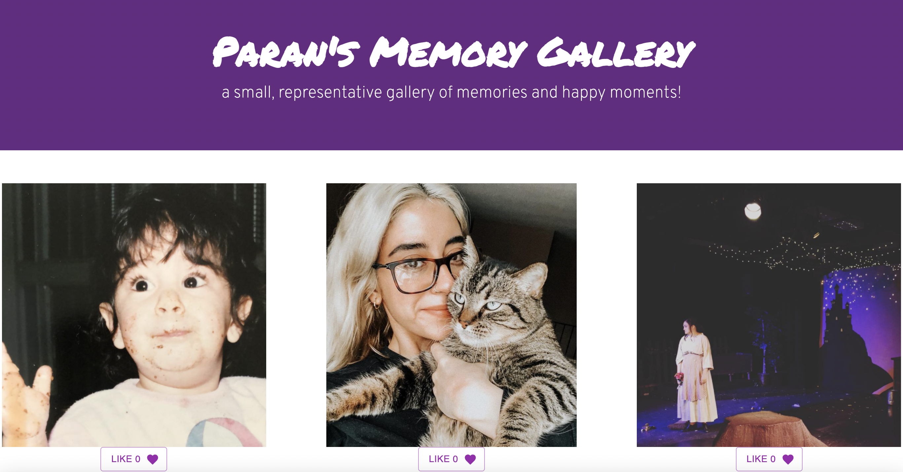

# Weekend Challenge: Image Gallery

## Table of Contents

- [Description](#description)
- [Screenshots](#screenshots)
- [Built With](#built-with)
- [Getting Started](#getting-started)
  - [Prerequisites](#prerequisites)
  - [Installation](#installation)
- [Usage](#usage)
- [License](#license)
- [Acknowledgements](#acknowledgements)
- [Contacts](#contacts)

## Description

After an introductory time with React, this project was a weekend challenge to create a photo gallery! This app is able to add likes to images and, when each image is clicked, displays a description for the picture. 

## Screenshots

"

## Built With

- CSS
- HTML5
- Javascript
- React
- Axios
- Node
- Material UI

## Getting Started

I spent most of this time familiarizing myself with the concept of "props" in React, and passing items between different components. I mapped out what components needed to be created and what props would be passing through. 

### Prerequisites

- git init
- npm install
- npm install express
- npm install nodemon --global
- npm install 
- npm install @mui/material
- npm install @mui/icons-material
- npm run server 
- npm run client (in a separate terminal)

### Installation

- import axios (helps with server routes)
- get data from the server 
- store server data in App.jsx via a GET call
- import useEffect (helps with running certain calls when the page is loaded)
- update document to make axios call when the page loads (using useEffect)

## Usage

You can use this project to display a number of images on the DOM with the capability to like and view description per image. 

This was a great project to help me familiarize myself with the basic functions of React and utilizing props—and I hope it can serve the same purpose for you, too! 

## Acknowledgements

A huge thank you and shoutout to Prime Digital Academy and my instructor Dev Jana, for their encouragement and support! Special thanks to Dillon Baxendell, Hannah Fligel, Stav Kidron, Chris Nelson, Rachel Hoey, and Jenny Cahill! 
